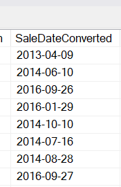
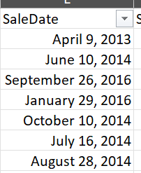
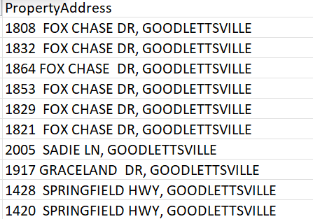
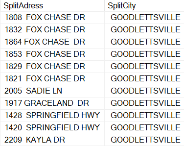
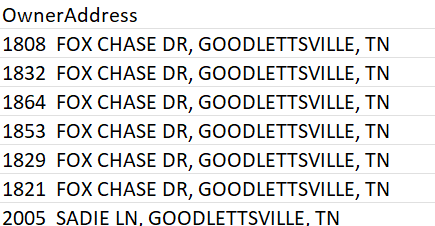
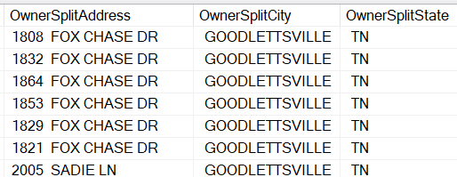

### Standardize Date Format:
In this section, the SaleDate column is converted to a standardized date format.

<pre>
  <code>
    ALTER TABLE SqlCleaning.dbo.NashvilleHousing
    Add SaleDateConverted Date;

    Update SqlCleaning.dbo.NashvilleHousing
    SET SaleDateConverted = CONVERT(Date,SaleDate)

  </code>
</pre>
    | 

## Populate Property Address Data:
In this query we fill in missing PropertyAddress values by using non-null values from other rows with the same ParcelID.
<pre>
  <code>

Select a.ParcelID, a.PropertyAddress, b.ParcelID, b.PropertyAddress, ISNULL(a.PropertyAddress,b.PropertyAddress)
From SqlCleaning.dbo.NashvilleHousing a
JOIN SqlCleaning.dbo.NashvilleHousing b
	on a.ParcelID = b.ParcelID 
	AND a.[UniqueID ] <> b.[UniqueID ]
	where a.PropertyAddress is null

	Update a
	Set PropertyAddress = ISNULL(a.PropertyAddress,b.PropertyAddress)
	From SqlCleaning.dbo.NashvilleHousing a
	JOIN SqlCleaning.dbo.NashvilleHousing b
	on a.ParcelID = b.ParcelID 
	AND a.[UniqueID ] <> b.[UniqueID ]
	where a.PropertyAddress is null

  </code>
</pre>

## Breaking out PropertyAddress into individual columns (Address, City)
New columns, SplitAddress and SplitCity, were added to the table, and existing PropertyAddress values were split into these columns using the PARSENAME and REPLACE functions.SET SplitAdress = PARSENAME(REPLACE(PropertyAddress, ',', '.'), 2):

The PARSENAME function is used to extract specific parts of a delimited string. In this case, PropertyAddress is assumed to be a comma-delimited string.
The REPLACE(PropertyAddress, ',', '.') part replaces commas with dots, preparing the string for parsing.
PARSENAME(..., 2) extracts the second part of the parsed string, which is assumed to be the street address, and assigns it to the new column SplitAdress.
SplitCity = PARSENAME(REPLACE(PropertyAddress, ',', '.'), 1):

Similar to the previous line, this part extracts the first part of the parsed string, assumed to be the city, and assigns it to the new column SplitCity.

<pre>
	<code>
		Alter Table SqlCleaning.dbo.NashvilleHousing -- Add New Columns 
		ADD 
		SplitAdress	NVARCHAR(255),
		SplitCity NVARCHAR(100);

		UPDATE SqlCleaning.dbo.NashvilleHousing
		 SET SplitAdress = PARSENAME(REPLACE(PropertyAddress,',','.'),2),
			 SplitCity = PARSENAME(REPLACE(PropertyAddress,',','.'),1)
	</code>
</pre>
    | 
   
## Breaking out OwnerAddress in to individual columns (Address, City, State)
New columns, SplitAddress and SplitCity, were added to the table, and existing PropertyAddress values were split into these columns using the PARSENAME and REPLACE functions.
<pre>
	<code>
		Alter Table SqlCleaning.dbo.NashvilleHousing  -- Add New Columns 
		ADD 
			OwnerSplitAddress NVARCHAR(255),
			OwnerSplitCity NVARCHAR(255),
			OwnerSplitState NVARCHAR(255);

			UPDATE SqlCleaning.dbo.NashvilleHousing
			SET OwnerSplitAddress = PARSENAME(REPLACE(OwnerAddress,',','.'),3),
				OwnerSplitCity = PARSENAME(REPLACE(OwnerAddress,',','.'),2),
				OwnerSplitState = PARSENAME(REPLACE(OwnerAddress,',','.'),1)
	</code>
</pre>
 | 

## Change Y and N to Yes and No in SoldAsVacant Field
 The SoldAsVacant column values, represented as 'Y' and 'N', were updated to 'Yes' and 'No' respectively for clarity and consistency.
 <pre>
	<code>
	UPDATE SqlCleaning.dbo.NashvilleHousing
	SET SoldAsVacant = 'Yes'
	Where SoldAsVacant = 'Y';

	-- For N 
	UPDATE SqlCleaning.dbo.NashvilleHousing
	SET SoldAsVacant = 'No'
	Where SoldAsVacant = 'N'

	-- Or we can use Case Statement

	UPDATE SqlCleaning.dbo.NashvilleHousing
				SET SoldAsVacant = CASE 
                      WHEN SoldAsVacant = 'Y' THEN 'Yes'
                      WHEN SoldAsVacant = 'N' THEN 'No'
                      ELSE SoldAsVacant
                  END;
	 </code>
 </pre>
 
## Handling Duplicate Values:
Duplicate rows were identified based on specific columns (ParcelID, PropertyAddress, SalePrice, SaleDate, LegalReference) using the ROW_NUMBER window function, and duplicates were subsequently removed from the dataset.
<pre>
	<code>
			WITH RowNumCTE AS
	(
	Select *,
		ROW_NUMBER () OVER(
		PARTITION BY
			ParcelID,
			PropertyAddress,
			SalePrice,
			SaleDate,
			LegalReference
			ORDER BY
			UniqueID
			) row_num

From SqlCleaning.dbo.NashvilleHousing
)
Delete 
From RowNumCTE
WHERE row_num > 1
	</code>
</pre>
